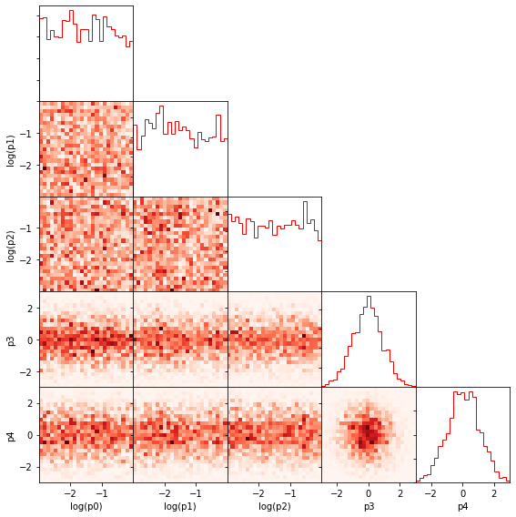
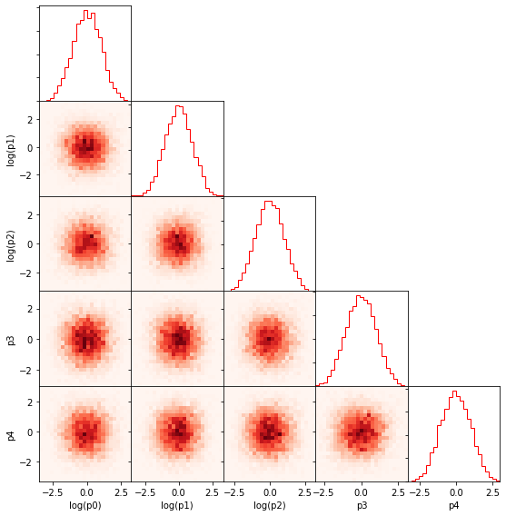
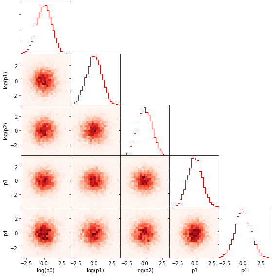

Tutorial
========

Preliminaries
-------------

The following set of examples shows the user how to train a Masked
Autoregressive Flow (MAF) and an example Kernel Density Estimator (KDE).
We further demonstrate how to use ``margarine`` to estimate the Kullback
Leibler divergence and Bayesian Dimensionality with the trained MAF and
KDE.

The code requires `anesthetic <https://pypi.org/project/anesthetic/>`__
to run.

.. code:: ipython3

    import numpy as np
    import matplotlib.pyplot as plt
    from anesthetic.samples import NestedSamples

In order to demonstrate the applications of the code we need to load
some example samples from a nested sampling run and we can visualise the
posterior distributions with ``anesthetic``. We write a helper function
to load the chains and transform the parameters in the first three
columns, which were generated with a log-uniform prior, into the unifrom
parameter space.

``margarine`` currently assumes that the parameters are uniformly
distributed when calculating the KL divergence and bayesian
dimensionality. It is therefore important to transform the parameters
into the uniform parameter space before we train our MAF and KDE.

.. code:: ipython3

    def load_chains(root):
        """
        Function uses anesthetic to load in a set of chains and returns
        the pandas table of samples, a numpy
        array of the parameters in the uniform space and weights.
        """

        samples = NestedSamples(root=root)

        try:
            names = ['p' + str(i) for i in range(ndims)]
            theta = samples[names].values
        except:
            names = [i for i in range(ndims)]
            theta = samples[names].values

        weights = samples.weights

        return samples, theta, weights

    ndims=5

    root = '../tests/test_samples/test'
    samples, theta, weights = load_chains(root)

To visualise the posterior we define another helper function that will
be useful later in the notebook.

.. code:: ipython3

    from anesthetic.plot import hist_plot_1d, hist_plot_2d

    def plotter(theta, names, w=None, ndims=5):
        """ Helper function that uses anesthetic to produce corner plots """
        fig, axes = plt.subplots(ndims, ndims, figsize=(8, 8), sharex='col')
        for i in range(ndims):
            for j in range(ndims):
                if i < j:
                    axes[i, j].axis('off')
                if i == j:
                    hist_plot_1d(axes[i, j], theta[:, i], weights=w,
                    xmin=theta[:, i].min(), xmax=theta[:, i].max(), color='r',
                    histtype='step', bins=25, density=True)
                if i < j:
                    hist_plot_2d(axes[j, i], theta[:, i], theta[:, j],
                                weights=w,
                                xmin=theta[:, i].min(), xmax=theta[:, i].max(),
                                ymin=theta[:, j].min(), ymax=theta[:, j].max(),
                                bins=25, density=True, cmap=plt.get_cmap('Reds'))
                if j not in set([0, ndims]):
                    axes[i, j].set_yticklabels([])
                if j == 0:
                    if i == 0:
                        axes[i, j].set_yticklabels([])
                    else:
                        axes[i, j].set_ylabel(names[i])
                if i == ndims-1:
                    axes[i, j].set_xlabel(names[j])
        plt.tight_layout()
        plt.subplots_adjust(hspace=0, wspace=0)
        plt.show()

    names = ['log(p' + str(i) + ')' if i in [0, 1, 2] else 'p' + str(i) for i in range(ndims)]
    plotter(theta, names, weights)

Masked Autoregressive Flows
---------------------------

Firstly we will look at training a Masked Autoregressive Flow or MAF
with ``margarine``. To train the MAF we first need to initalise the
class with the samples and corresponding weights.

.. code:: ipython3

    import os
    os.chdir('../')

    from margarine.maf import MAF

    bij = MAF(theta, weights)
    bij.train(100)

.. parsed-literal::

    Epoch: 0 Loss: 0.0007185101
    Epoch: 1 Loss: 0.0007014023
    Epoch: 2 Loss: 0.0006839341
    Epoch: 3 Loss: 0.00066634326
    Epoch: 4 Loss: 0.0006487031
    Epoch: 5 Loss: 0.00063104363
    Epoch: 6 Loss: 0.0006133788
    Epoch: 7 Loss: 0.0005957194
    Epoch: 8 Loss: 0.00057807605
    Epoch: 9 Loss: 0.000560463
    Epoch: 10 Loss: 0.00054290093
    Epoch: 11 Loss: 0.00052541785
    Epoch: 12 Loss: 0.0005080515
    Epoch: 13 Loss: 0.00049085025
    Epoch: 14 Loss: 0.00047387503
    Epoch: 15 Loss: 0.00045719987
    Epoch: 16 Loss: 0.0004409128
    Epoch: 17 Loss: 0.00042511517
    Epoch: 18 Loss: 0.00040991933
    Epoch: 19 Loss: 0.00039544463
    Epoch: 20 Loss: 0.00038181068
    Epoch: 21 Loss: 0.00036913107
    Epoch: 22 Loss: 0.0003575051
    Epoch: 23 Loss: 0.00034701102
    Epoch: 24 Loss: 0.00033769925
    Epoch: 25 Loss: 0.00032958362
    Epoch: 26 Loss: 0.0003226317
    Epoch: 27 Loss: 0.00031675794
    Epoch: 28 Loss: 0.00031182577
    Epoch: 29 Loss: 0.0003076632
    Epoch: 30 Loss: 0.00030409006
    Epoch: 31 Loss: 0.00030094603
    Epoch: 32 Loss: 0.00029811086
    Epoch: 33 Loss: 0.00029550795
    Epoch: 34 Loss: 0.00029309577
    Epoch: 35 Loss: 0.000290852
    Epoch: 36 Loss: 0.00028876044
    Epoch: 37 Loss: 0.00028680352
    Epoch: 38 Loss: 0.00028495849
    Epoch: 39 Loss: 0.0002831965
    Epoch: 40 Loss: 0.0002814832
    Epoch: 41 Loss: 0.00027978222
    Epoch: 42 Loss: 0.00027806248
    Epoch: 43 Loss: 0.00027630394
    Epoch: 44 Loss: 0.00027450087
    Epoch: 45 Loss: 0.00027266104
    Epoch: 46 Loss: 0.0002708026
    Epoch: 47 Loss: 0.00026895
    Epoch: 48 Loss: 0.00026712997
    Epoch: 49 Loss: 0.00026536686
    Epoch: 50 Loss: 0.00026367788
    Epoch: 51 Loss: 0.0002620711
    Epoch: 52 Loss: 0.00026054538
    Epoch: 53 Loss: 0.00025909403
    Epoch: 54 Loss: 0.00025770898
    Epoch: 55 Loss: 0.00025638303
    Epoch: 56 Loss: 0.00025510968
    Epoch: 57 Loss: 0.0002538809
    Epoch: 58 Loss: 0.0002526861
    Epoch: 59 Loss: 0.00025151268
    Epoch: 60 Loss: 0.00025035004
    Epoch: 61 Loss: 0.00024919215
    Epoch: 62 Loss: 0.00024803917
    Epoch: 63 Loss: 0.0002468963
    Epoch: 64 Loss: 0.0002457709
    Epoch: 65 Loss: 0.00024467031
    Epoch: 66 Loss: 0.00024360023
    Epoch: 67 Loss: 0.00024256505
    Epoch: 68 Loss: 0.00024156799
    Epoch: 69 Loss: 0.00024061205
    Epoch: 70 Loss: 0.00023969925
    Epoch: 71 Loss: 0.00023883079
    Epoch: 72 Loss: 0.00023800644
    Epoch: 73 Loss: 0.0002372256
    Epoch: 74 Loss: 0.00023648709
    Epoch: 75 Loss: 0.0002357906
    Epoch: 76 Loss: 0.00023513584
    Epoch: 77 Loss: 0.00023452267
    Epoch: 78 Loss: 0.00023394993
    Epoch: 79 Loss: 0.00023341607
    Epoch: 80 Loss: 0.00023291916
    Epoch: 81 Loss: 0.00023245814
    Epoch: 82 Loss: 0.00023203301
    Epoch: 83 Loss: 0.00023164476
    Epoch: 84 Loss: 0.0002312939
    Epoch: 85 Loss: 0.00023098035
    Epoch: 86 Loss: 0.00023070279
    Epoch: 87 Loss: 0.00023045961
    Epoch: 88 Loss: 0.0002302486
    Epoch: 89 Loss: 0.00023006761
    Epoch: 90 Loss: 0.00022991415
    Epoch: 91 Loss: 0.00022978513
    Epoch: 92 Loss: 0.00022967775
    Epoch: 93 Loss: 0.00022958912
    Epoch: 94 Loss: 0.00022951687
    Epoch: 95 Loss: 0.00022945873
    Epoch: 96 Loss: 0.00022941224
    Epoch: 97 Loss: 0.00022937522
    Epoch: 98 Loss: 0.00022934566
    Epoch: 99 Loss: 0.00022932225

We can then generate samples from the bijector using the following code
which technically takes samples on the hypercube and transforms them
into samples on the target posterior distribution,

.. code:: ipython3

    x = bij(np.random.uniform(0, 1, size=(len(theta), theta.shape[-1])))

    plotter(x, names)

Alternatively we can generate samples with the following code which
takes in an integer and returns an array of shape (int, 5). The
``.sample()`` function is a proxy for ``__call__``.

.. code:: ipython3

    x = bij.sample(5000)

We can then go ahead an calculate the corresponding kl divergence and
Bayesian dimensionality.

The samples presented here were generated using a gaussian likelihood
and fitting with nested sampling for 5 parameters. We can use
``anesthetic`` to calculate the KL divergence and Bayesian
dimensionality for the samples for comparison. We see very similar
results and note that the similarity improves with the number of epochs.

.. code:: ipython3

    from margarine.marginal_stats import maf_calculations

    stats = maf_calculations(bij, x)
    print(stats.klDiv(), samples.D())
    print(stats.bayesian_dimensionality(), samples.d())

.. parsed-literal::

    tf.Tensor(3.2990043, shape=(), dtype=float32) 3.3308079438366938
    tf.Tensor(4.3727474, shape=(), dtype=float32) 5.013952162478263

We could imagine that the above set of parameters is a sub-sample of
perhaps signal parameters that we are interested in and having
marginalised out the nuisance parameters we can use ``margarine`` to
determine how well constrained the sub-space is.

As an example we can train a MAF on three of the parameters in this
distribution.

.. code:: ipython3

    theta_reduced = theta[:, 1:-1]
    names_reduced = names[1:-1]

    bij = MAF(theta_reduced, weights)
    bij.train(100)
    x = bij.sample(5000)

    plotter(x, names_reduced, ndims=3)

    stats = maf_calculations(bij, x)
    print(stats.klDiv())
    print(stats.bayesian_dimensionality())

.. parsed-literal::

    Epoch: 0 Loss: 0.00043151045
    Epoch: 1 Loss: 0.00041672972
    Epoch: 2 Loss: 0.00040160108
    Epoch: 3 Loss: 0.0003863657
    Epoch: 4 Loss: 0.00037109375
    Epoch: 5 Loss: 0.00035581551
    Epoch: 6 Loss: 0.00034055865
    Epoch: 7 Loss: 0.0003253689
    Epoch: 8 Loss: 0.00031032556
    Epoch: 9 Loss: 0.000295559
    Epoch: 10 Loss: 0.00028127024
    Epoch: 11 Loss: 0.00026773606
    Epoch: 12 Loss: 0.0002552729
    Epoch: 13 Loss: 0.0002441286
    Epoch: 14 Loss: 0.00023431709
    Epoch: 15 Loss: 0.00022553187
    Epoch: 16 Loss: 0.00021728151
    Epoch: 17 Loss: 0.00020923858
    Epoch: 18 Loss: 0.00020157515
    Epoch: 19 Loss: 0.0001947428
    Epoch: 20 Loss: 0.00018895789
    Epoch: 21 Loss: 0.00018402831
    Epoch: 22 Loss: 0.00017959857
    Epoch: 23 Loss: 0.00017541902
    Epoch: 24 Loss: 0.00017139025
    Epoch: 25 Loss: 0.0001674916
    Epoch: 26 Loss: 0.00016375972
    Epoch: 27 Loss: 0.00016028345
    Epoch: 28 Loss: 0.0001571421
    Epoch: 29 Loss: 0.00015434317
    Epoch: 30 Loss: 0.0001518309
    Epoch: 31 Loss: 0.00014954529
    Epoch: 32 Loss: 0.00014746259
    Epoch: 33 Loss: 0.00014559379
    Epoch: 34 Loss: 0.00014396895
    Epoch: 35 Loss: 0.00014262673
    Epoch: 36 Loss: 0.00014160143
    Epoch: 37 Loss: 0.00014089704
    Epoch: 38 Loss: 0.00014046444
    Epoch: 39 Loss: 0.00014021117
    Epoch: 40 Loss: 0.00014004944
    Epoch: 41 Loss: 0.00013994247
    Epoch: 42 Loss: 0.00013990093
    Epoch: 43 Loss: 0.00013992687
    Epoch: 44 Loss: 0.00013996518
    Epoch: 45 Loss: 0.0001399216
    Epoch: 46 Loss: 0.0001397332
    Epoch: 47 Loss: 0.00013941246
    Epoch: 48 Loss: 0.00013902439
    Epoch: 49 Loss: 0.00013863404
    Epoch: 50 Loss: 0.00013828062
    Epoch: 51 Loss: 0.00013798769
    Epoch: 52 Loss: 0.0001377799
    Epoch: 53 Loss: 0.00013768119
    Epoch: 54 Loss: 0.00013769431
    Epoch: 55 Loss: 0.00013778618
    Epoch: 56 Loss: 0.00013789683
    Epoch: 57 Loss: 0.00013796882
    Epoch: 58 Loss: 0.00013797365
    Epoch: 59 Loss: 0.00013791746
    Epoch: 60 Loss: 0.00013782585
    Epoch: 61 Loss: 0.00013772433
    Epoch: 62 Loss: 0.00013762737
    Epoch: 63 Loss: 0.00013753776
    Epoch: 64 Loss: 0.00013745317
    Epoch: 65 Loss: 0.00013737299
    Epoch: 66 Loss: 0.00013730218
    Epoch: 67 Loss: 0.00013724956
    Epoch: 68 Loss: 0.00013722175
    Epoch: 69 Loss: 0.00013721581
    Epoch: 70 Loss: 0.00013721827
    Epoch: 71 Loss: 0.00013721173
    Epoch: 72 Loss: 0.0001371857
    Epoch: 73 Loss: 0.00013714364
    Epoch: 74 Loss: 0.00013709921
    Epoch: 75 Loss: 0.00013706567
    Epoch: 76 Loss: 0.00013704767
    Epoch: 77 Loss: 0.00013704058
    Epoch: 78 Loss: 0.00013703684
    Epoch: 79 Loss: 0.00013703172
    Epoch: 80 Loss: 0.00013702485
    Epoch: 81 Loss: 0.00013701744
    Epoch: 82 Loss: 0.00013700967
    Epoch: 83 Loss: 0.00013700046
    Epoch: 84 Loss: 0.00013698814
    Epoch: 85 Loss: 0.00013697242
    Epoch: 86 Loss: 0.00013695442
    Epoch: 87 Loss: 0.00013693656
    Epoch: 88 Loss: 0.0001369206
    Epoch: 89 Loss: 0.00013690711
    Epoch: 90 Loss: 0.00013689484
    Epoch: 91 Loss: 0.00013688198
    Epoch: 92 Loss: 0.00013686798
    Epoch: 93 Loss: 0.0001368536
    Epoch: 94 Loss: 0.00013683976
    Epoch: 95 Loss: 0.00013682686
    Epoch: 96 Loss: 0.00013681434
    Epoch: 97 Loss: 0.00013680183
    Epoch: 98 Loss: 0.00013678914
    Epoch: 99 Loss: 0.00013677636

.. image:: output_15_1.png

.. parsed-literal::

    tf.Tensor(1.9784489, shape=(), dtype=float32)
    tf.Tensor(2.5428524, shape=(), dtype=float32)

Kernel Density Estimators
-------------------------

We can perform a similar analysis using Kernel Density Estimators rather
than MAFs which is done with the following code. Note that the
generation of the ‘trained’ model is significantly quicker than when
performed with the MAFs.

.. code:: ipython3

    from margarine.kde import KDE
    kde = KDE(theta, weights)
    kde.generate_kde()
    x = kde.sample(5000)

    plotter(x, names)

    from margarine.marginal_stats import kde_calculations

    stats = kde_calculations(kde, x)
    print(stats.klDiv(), samples.D())
    print(stats.bayesian_dimensionality(), samples.d())

.. parsed-literal::

    tf.Tensor(3.1492083, shape=(), dtype=float32) 3.3308079438366938
    tf.Tensor(4.025139, shape=(), dtype=float32) 5.013952162478263

Rather than using the ``kde.sample()`` function to generate samples we
could transform samples from the hypercube with the following code and
the ``__call__()`` function. However, we note that this is a much slower
method of generating samples as it is designed to be bijective.
Transformation from the hypercube is useful if we would like to use a
trained KDE or MAF as the prior in a subseqeunt nested sampling run
however is not necessary if we simply want to calcualte marginal
Bayesian statistics.

.. code:: ipython3

    x = kde(np.random.uniform(0, 1, size=(10, theta.shape[-1])))
    print(x)

.. parsed-literal::

    [[-2.30580893  0.2615454   1.0305738   0.95230235 -0.9160518 ]
     [ 0.449536   -0.21128596  0.37450897 -0.06924562 -0.1435756 ]
     [-0.23842612  1.89020679  1.01175275 -0.79411737 -1.26997843]
     [ 0.69827796 -0.85031383  0.12800782  1.87217983 -0.0720315 ]
     [-1.96867173 -1.70556795 -0.56749216 -1.02797262 -0.87023201]
     [-0.55155518 -0.60825292  1.81532878 -1.32111645  0.61482667]
     [-0.8416832   0.18485707  2.00253196  0.49622835 -0.63868005]
     [-0.52705685 -0.11567092 -1.41513758 -1.26160741 -0.94664933]
     [ 0.87743055  2.28065551 -0.94326398 -1.12061011 -0.03694226]
     [ 0.39296398  0.62991565  1.31726872  0.46559934 -0.55856522]]
