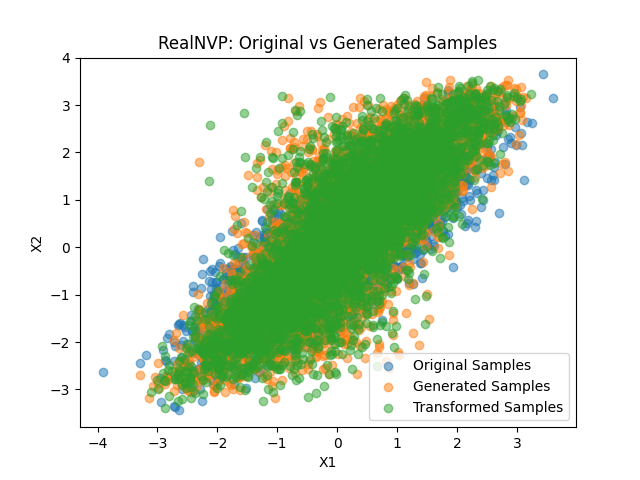
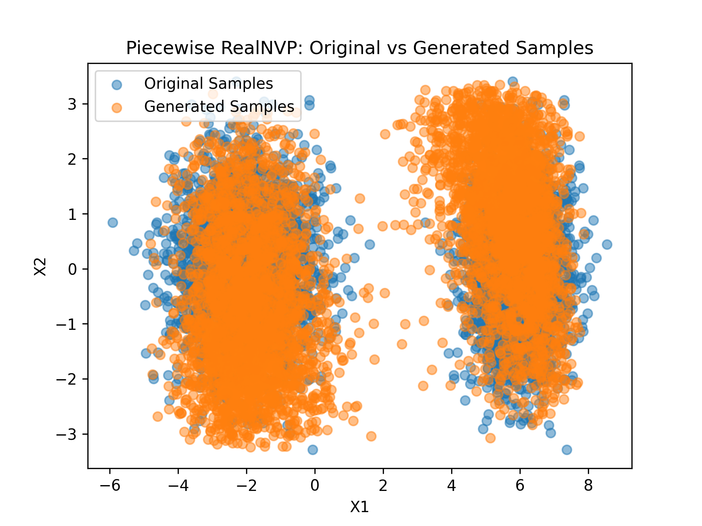

# Tutorials and Examples

This document provides a collection of tutorials and examples to help you get started with various topics. Each section includes step-by-step instructions and code snippets to guide you through the process.

There have been significant breaking changes to the API since version 2.0.0 when `margarine` moved to JAX from TensorFlow. If you are using an older version (1.x.x) please refer to the [v1.4.2 documentation](https://margarine.readthedocs.io/en/latest/#30887389) instead.

## The Basics

`margarine` has several different density estimators that can be used to learn probability distributions from samples. Each estimator has a common interface and set of methods including `train()`, `sample()`, `log_prob()`, `log_like()`, `save()` and `load()`. The following example demonstrates how to train a RealNVP density estimator and generate samples from it. Similar patterns can be followed for other estimators in the library and the API reference can be consulted for specifics.

We first need to generate some example samples to train on. In this case we will generate samples from a 2D Gaussian distribution with some correlation between the two dimensions.

```python
import jax
import jax.numpy as jnp
import matplotlib.pyplot as plt

from margarine.estimators.realnvp import RealNVP

nsamples = 5000
key = jax.random.PRNGKey(0)
original_samples = jax.random.multivariate_normal(
    key,
    mean=jnp.array([0.0, 0.0]),
    cov=jnp.array([[1.0, 0.8], [0.8, 1.0]]),
    shape=(nsamples,),
)
```

We can then create a RealNVP density estimator, train it on the samples, and generate new samples from the learned distribution.

```python
realnvp_estimator = RealNVP(
        original_samples,
        in_size=2,
        hidden_size=50,
        num_layers=6,
        num_coupling_layers=6,
    )
key, subkey = jax.random.split(key)
realnvp_estimator.train(
            subkey,
            learning_rate=1e-3,
            epochs=2000,
            patience=50,
            batch_size=1000,
)
generated_samples = realnvp_estimator.sample(subkey, num_samples=nsamples)
```

Finally, we can visualize the original samples and the samples generated by the RealNVP estimator to see how well it has learned the distribution.

```python
plt.scatter(
    original_samples[:, 0], original_samples[:, 1], alpha=0.5, label="Original Samples"
)
plt.scatter(
    generated_samples[:, 0], generated_samples[:, 1], alpha=0.5, label="Generated Samples"
)
```

You can also calculate the log-probability of samples under the learned distribution using the `log_prob()` method.

```python
log_probs = realnvp_estimator.log_prob(original_samples)
print("Log probabilities of original samples:", log_probs)
```

and transform samples from a unit hypercube to the learned distribution using `__call__` method.

```python
key, subkey = jax.random.split(key)
unit_samples = jax.random.uniform(subkey, shape=(nsamples, 2))
transformed_samples = realnvp_estimator(unit_samples)


plt.scatter(
    transformed_samples[:, 0], transformed_samples[:, 1], alpha=0.5, label="Transformed Samples"
)

plt.legend()
plt.title("RealNVP: Original vs Generated Samples")
plt.xlabel("X1")
plt.ylabel("X2")
plt.show()
```



This is essentially what the `sample()` method does internally by transforming uniform samples to the learned distribution.

This is just a basic example to get you started. Each density estimator in `margarine` has its own specific parameters and options, so be sure to check the documentation for more details on how to use them effectively.


## Calculating Bayesian Statistics

`margarine` has helper functions to calculate Bayesian statistics including the Kullback-Leibler (KL) divergence and the Bayesian model dimensionality between two density estimators. 

These functions require a density estimator for both the posterior and prior distributions. The following example demonstrates how to calculate the KL divergence and Bayesian model dimensionality between two RealNVP estimators trained on different datasets.

We start by generating some example samples for the prior distribution and training a RealNVP estimator. In practice the helper functions will work with any object that has a `log_prob()` method that takes samples (although you might get type hinting errors if you use an object that doesn't inherit from `margarine.base.baseflow.BaseDensityEstimator`).

```python
prior_samples = jax.random.uniform(
    key,
    shape=(nsamples, 2),
    minval=-4.0,
    maxval=4.0,
)

prior_estimator = RealNVP(
        prior_samples,
        in_size=2,
        hidden_size=50,
        num_layers=6,
        num_coupling_layers=6,
    )
key, subkey = jax.random.split(key)
prior_estimator.train(
            subkey,
            learning_rate=1e-3,
            epochs=2000,
            patience=50,
            batch_size=1000,
)
```

We can then caluclate the statistics using the helper functions.

```python
from margarine.statistics import kldivergence, model_dimensionality

kl_div = kldivergence(realnvp_estimator, prior_estimator, transformed_samples)
model_dim = model_dimensionality(realnvp_estimator, prior_estimator, transformed_samples)
print("KL Divergence:", kl_div)
print("Model Dimensionality:", model_dim)
```

You can also calculate the KL divergence and model dimensionality between differnt types of `margarine` density estimators e.g. between a RealNVP and a KDE estimator.

Older versions of `margarine` include an estimate of the error on statistics like the KL divergence and model dimensionality. This was estimated by calculating the statistics using samples drawn from the learned distribution and a reserved subset of the original samples and then comparing the two estimates. An additional source of error comes from the stochastic nature of training normalising flows. 
This functionality has been removed in the current version to simplify the API, and error estimation is left to the user to implement as needed.

## Piecewise Normalising Flows

`margarine` includes piecewise normalising flow density estimators that can model multimodal distributions more effectively than standard normalising flows. Piecewise NFs are described in more detail in [this paper](https://arxiv.org/abs/2305.02930). 

Essentially piecewise NFs divide the samples into clusters using K-Means clustering and then train a separate normalising flow on each cluster. The overall density is then a weighted sum of the densities from each cluster. In `margarine` piecewise NFs can be built from any of the standard density estimators using the `clustered` estimator. The example below demonstrated how to build a piecewise RealNVP estimato.

```python
import jax
import jax.numpy as jnp
import matplotlib.pyplot as plt

from margarine.estimators.clustered import cluster
from margarine.estimators.realnvp import RealNVP

nsamples = 5000
key = jax.random.PRNGKey(0)

target_mean_one = jnp.array([-2.0, 0.0])
target_cov_one = jnp.array([[1.0, 0.0], [0.0, 1.0]])
target_mean_two = jnp.array([6.0, 0.0])
target_cov_two = jnp.array([[0.5, 0.0], [0.0, 1.0]])


original_samples = jnp.concatenate(
    [
        jax.random.multivariate_normal(
            key,
            mean=target_mean_one,
            cov=target_cov_one,
            shape=(nsamples // 2,),
        ),
        jax.random.multivariate_normal(
            key,
            mean=target_mean_two,
            cov=target_cov_two,
            shape=(nsamples // 2,),
        ),
    ],
    axis=0,
)

weights = jnp.ones(original_samples.shape[0])

cluster_estimator = cluster(
    original_samples,
    base_estimator=RealNVP,
    weights=weights,
    in_size=2,
    hidden_size=50,
    num_layers=10,
    num_coupling_layers=4,
    clusters=2,
)

key, subkey = jax.random.split(key)
cluster_estimator.train(
    key=subkey,
    learning_rate=1e-4,
    epochs=2000,
    patience=50,
    batch_size=len(original_samples),
)

key, subkey = jax.random.split(key)
samples = cluster_estimator.sample(subkey, 5000)

plt.scatter(
    original_samples[:, 0], original_samples[:, 1], alpha=0.5, label="Original Samples"
)
plt.scatter(samples[:, 0], samples[:, 1], alpha=0.5, label="Generated Samples")
plt.legend()
plt.title("Piecewise RealNVP: Original vs Generated Samples")
plt.xlabel("X1")
plt.ylabel("X2")
plt.show()
```



Piecewise estimators have all the same methods as standard estimators and often perform better on multimodal distributions.

## Saving and Loading Models

Each density estimator in `margarine` has `save()` and `load()` methods to save the model parameters to disk and load them back later. This is useful for persisting trained models and reusing them without having to retrain.

Models are saved in zips with custom file extensions `.marg` and `.clumarg` for standard and piecwise estimators respectively. They can be saved and loaded as follows:

```python
# Save the model
realnvp_estimator.save("realnvp_model")
# Load the model
loaded_estimator = RealNVP.load("realnvp_model")
```

